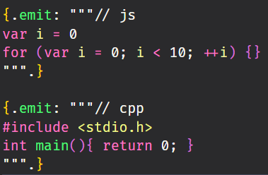
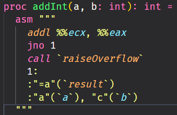
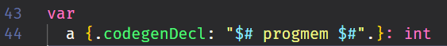
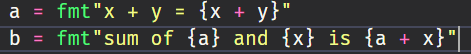
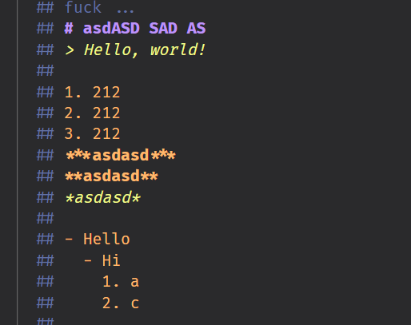
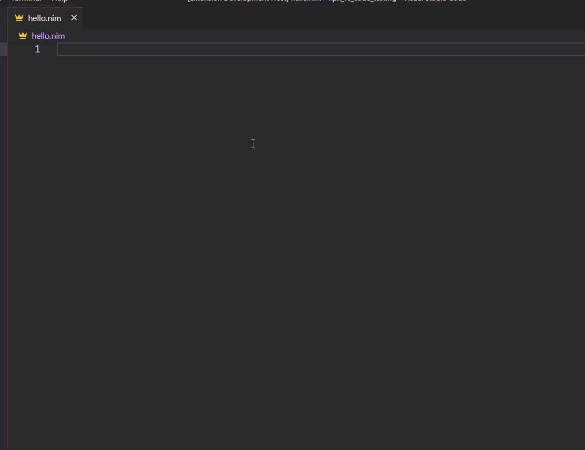

# HappyX For Visual Studio Code ❤

Official VS Code plugin for use HappyX

## Features ✨
  
- `Nim and nimble support`
  HappyX for VS Code supports default Nim and Nimble and improves it!
- `Nimja files support`
  HappyX also supports `.nimja` template files
- `Emit language support`
  You can specify which language you're use
  
- `Assembler support`
  You can write assembler with syntax highlight (need asm extension)
  
- `Some features`
  More syntax highlight here!
  
  
  
  
- `Code snippets`
  HappyX provides code snippets for `components`, `mounts`, `request models` and other constructions

## Have A Nice Idea / Found A Bug? ✨

[Open issue!](https://github.com/HapticX/hpx-vs-code/issues/new)

